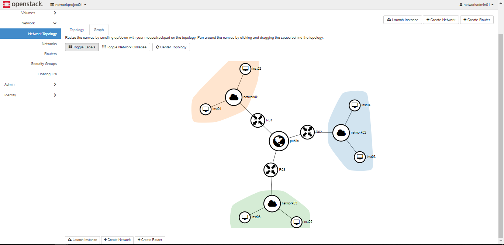
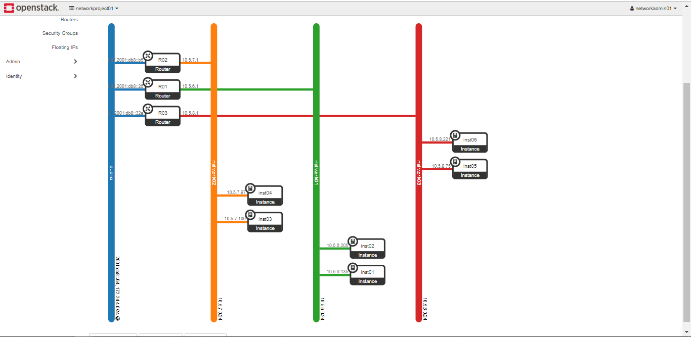
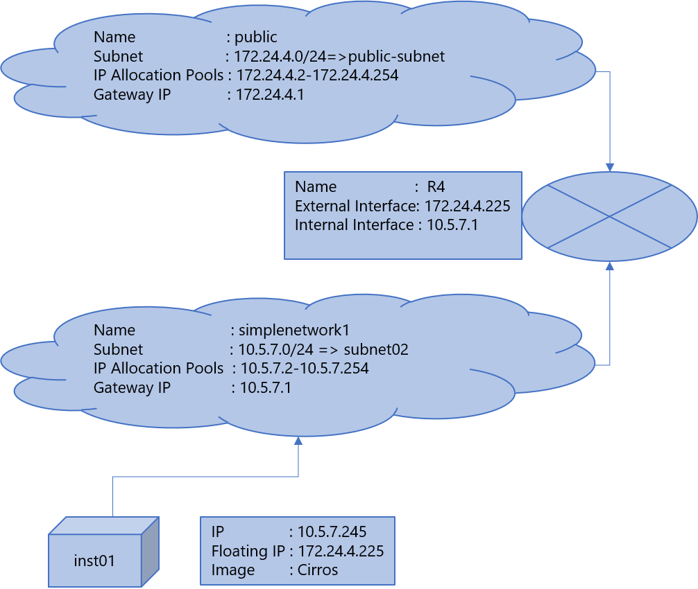

# Neutron Networking
  
    Installation package : devstack
    Openstack version: stein
    
    Network Project 01
    ==============================================================================================
    
    Horizon Graph:

    Horizon Topology:

    
    
    Simple Network 
    ==============================================================================================
    
    Objective: 
    
        Creating a simple neutron network with cirros instance , interconnect the network with public network and assign floating IP.
    
    Completed Steps: 
    
    Installation: 
        1)  Install openstack through devstack
        2)  Trouble shoot and fix installation issues
    Keystone: 
        3)  Create project name: simplenetworkproject
        4)  Create User and assign project: networkadmin01
    Glance: 
        5)  Dowload cirros image to host machine
        6)  upload image to glance
    Neutron: 
        7)  Create internal network [ simplenetwork1 ]
        8)  Create subnet [ subnet02 ]
        9)  Create router [ R4 ] , add subnet to the router and assign it to public ip
        10) Create server : inst01
        11) Create floating IP and assign to inst01
        12) Verify

    Simple Network : 
 
 
